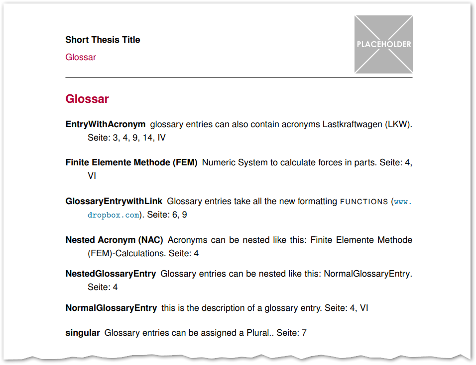

# Thesis example written in Latex

This is a minimal compilable example of Latex code to write a thesis about a Project.\
It includes some Predefined commands for Milestones, includePDF as Attachment, Glossaries and Litterature.

## Features

See [main.pdf](main.pdf) for full Preview.

|Title|Milestones | Acronyms| Glossary|
|-|-|-|-|
||| | |
|**TOC**|**Image and Table TOC** | **Signatures**| **People**|
||| | |
| **Included PDFs**| **Literature** |
| ||

## Instructions

If you have [Docker](https://www.docker.com/) and [VCCode](https://code.visualstudio.com/) installed, you can make use of the [`devcontainer.json`](./.devcontainer/devcontainer.json). Just open the Project folder in VSCode and `reopen in devcontainer`

Run `make` to compile the Project. \
Run `make clean` to delete auxiliiary files.

## Tipps

- Babel is set to German. Some additional configuration is made in [`configuration.tex`](./tex/Configuration.tex)
- Use Vector images for better print quality

## Windows Specialties

Make sure the package [xindy](https://ctan.org/pkg/xindy) is installed using Miktex **Admin** Mode.\
Also make sure to have [strawberryperl](https://strawberryperl.com/) installed

## VScode Latex

### Windows

Enter in `cpan`:

```perl
install Log::Log4perl
install Log::Dispatch::File
install YAML::Tiny
install File::HomeDir
```
